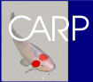

# CARP

### Installing from bioconda

(SCJ-)CARP can be installed as `carp` from bioconda. Create/switch to the environment in which you want to use the carp software and run:

`conda install -c bioconda carp`

Note: This version only includes the programs `carp`, `carp-scan` and `carp-extract`, not currently the python utility scripts or workflows included in this repository.

### Building from source

Install `rust`/`cargo`, clone this repository and run:

`cargo build --release`

The resulting binaries (`carp`,`carp-scan`,`carp-extract`) are then found in `./target/release/`.

## How to run

All binaries need to be run with either `--gfa <your-file> ` to read `<your-file>` in [gfa format](https://github.com/GFA-spec/GFA-spec/blob/master/GFA1.md) or with `--unimog <your-file> ` to read `<your-file>` in [unimog format](https://bibiserv.cebitec.uni-bielefeld.de/dcj).

Optionally the binaries support the following parameters:

| Parameter | Behavior |
| ------ | ------ |
| `-s`/`--size-thresh <st>`| Filter out all nodes smaller than `<st>`. Note: Since unimog files do not support node lengths, this will filter all nodes in a graph from a unimog file |
| `-t`/`--num-threads <t>`       | Use `<t>` threads for the main computation of the program. This currently does not apply to file reading.       |
| `-h`/`--help`       | Displays a help text for the given program |

### `carp`

This program calculates the SCJ CARP measure for the given pangenome and outputs it to the command line. 

`-m`/`--write-measure 
` writes the CARP measure to file `
`.

`-a`/`--write-ancestor 
`  writes one potential set of  ancestral adjacencies to file `
`.

Example

`carp --gfa testfiles/test_ypestis.gfa -t 4 -m test_measure.txt -s 100 -a test_ancestor.txt`

### `carp-scan`

This program calculates the SCJ CARP measure for the environment of each node in the (trimmed) graph.
It can output a certain percentile of nodes by surrounding complexity as identified by the SCJ CARP measure, but it can also color the graph by complexity and output a histogram of complexities.

`-c`, `--context-len <c>` Defines the context length `<c>` in base pairs that will be regarded around each node. Note that since unimog does not support node lengths, for unimog files this is instead the number of nodes in the context.

`--colored-gfa <f>`         Outputs an annotated gfa to `<f>` visualizing complexities. Can be opened in bandage.

`--output-histogram <f>`    Outputs counts for a histogram of complexities. Use `plotscripts/plot_hist.py` to visualize it.

`--lower-percentile <lo>`   Output node ids that lie between the lower and higher percentile to standard output.

`--higher-percentile <hi>`  Output node ids that lie between the lower and higher percentile to standard output. Default 1.00.

`--ignore-gfa-overlap`      Ignore the overlaps specified in the GFA for environment extraction. This parameter has to be used when filtering nodes as currently variable overlaps between nodes are not supported.

Example

`carp-scan --gfa testfiles/test_ypestis.gfa -t 4  --context-len 2000 --lower-percentile 0.49 --higher-percentile 0.51 --output-histogram test.hist --colored-gfa test_colored.gfa  > test_average_nodes.txt `

View the histogram with: ` python3 plotscripts/plot_hist.py test.hist  --num-buckets 1000`

Open `test_colored.gfa` in bandage for a visualization of node complexities.

Use `python3 plotscripts/gradient.py test_colored.gfa` to obtain the color gradient used in the gfa file to color the nodes in bandage.

### `carp-extract`

This program allows to ectract the surrounding graph of a node to gfa. This gfa file is output to stdout and needs to be piped into a file.

`-n, --start-node <n>`    Id `<n>` of the start node.

`-d, --max-dist <d>`    Defines the context length `<d>` in base pairs that will be regarded around each node. Note that since unimog does not support node lengths, for unimog files this is instead the number of nodes in the context.

